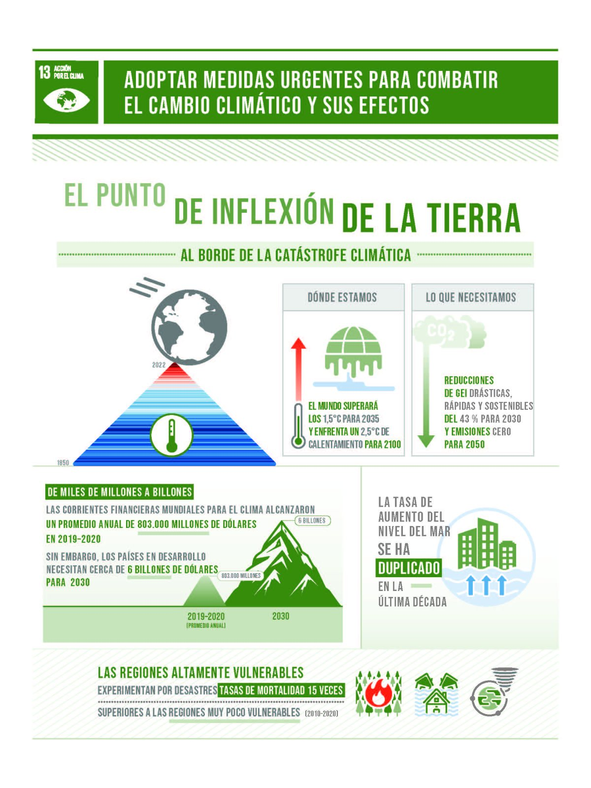

## 1.2. ODS más relevantes de Nuestro Sector Productivo.

### 1.2.1. Seleccion de los ODS mas relevantes y justificacion
- **ODS 9: Industria, innovación e infraestructura**
  - Justificación: El sector TIC es clave para el desarrollo de infraestructuras digitales, fomentar la innovación tecnológica y apoyar a otras industrias a través de la digitalización.
  
- **ODS 12: Producción y consumo responsables**
  - Justificación: Es importante fomentar la eficiencia energética en el diseño de hardware y software, así como gestionar adecuadamente los residuos electrónicos (RAEE).

- **ODS 13: Acción por el clima**
  - Justificación: Las TIC pueden contribuir a la lucha contra el cambio climático mediante soluciones que reduzcan las emisiones (teletrabajo, smart cities, redes inteligentes), aunque también es necesario controlar el impacto ambiental de las infraestructuras tecnológicas (centros de datos, redes de comunicaciones).

- **ODS 4: Educación de calidad**
  - Justificación: A través del desarrollo de herramientas educativas digitales, plataformas de e-learning y el fomento de competencias digitales, el sector TIC contribuye directamente a la educación inclusiva y de calidad.
  
  

- **ODS 10: Reducción de desigualdades**
  - Justificación: Las TIC pueden reducir la brecha digital, facilitando el acceso equitativo a la tecnología para todas las personas, especialmente en zonas rurales o desfavorecidas.

- **ODS 16: Paz, justicia e instituciones sólidas**
  - Justificación: La ciberseguridad, la protección de datos personales y la privacidad son pilares esenciales para garantizar un entorno digital seguro y confiable para gobiernos, empresas y ciudadanos.

---
### 1.2.2. Objetivos y metas especificas de los ODS aplicables a Nuestro Sector Productivo

A continuación, se detallan algunas metas concretas de los ODS mencionados que se relacionan directamente con el sector TIC:

#### **ODS 9: Industria, innovación e infraestructura**
- **Meta 9.1**: Desarrollar infraestructuras fiables, sostenibles, resilientes y de calidad, con acceso equitativo.
- **Meta 9.5**: Aumentar la investigación científica y mejorar la capacidad tecnológica de los sectores industriales, incluyendo las TIC.
- **Meta 9.c**: Aumentar significativamente el acceso a las tecnologías de la información y las comunicaciones y esforzarse por proporcionar acceso universal y asequible a Internet en los países menos adelantados.

#### **ODS 12: Producción y consumo responsables**
- **Meta 12.5**: Reducir la generación de desechos mediante actividades de prevención, reducción, reciclado y reutilización (en especial RAEE).
- **Meta 12.6**: Alentar a las empresas a adoptar prácticas sostenibles e informar sobre la sostenibilidad en sus ciclos productivos (incluyendo las TIC).
  

#### **ODS 13: Acción por el clima**
- **Meta 13.1**: Fortalecer la resiliencia y la capacidad de adaptación a los riesgos relacionados con el clima.
- **Meta 13.3**: Mejorar la educación, la sensibilización y la capacidad humana e institucional sobre mitigación del cambio climático y reducción de sus efectos (uso de TIC en educación ambiental y soluciones inteligentes).

#### **ODS 4: Educación de calidad**
- **Meta 4.4**: Aumentar el número de jóvenes y adultos con habilidades relevantes, incluidas competencias técnicas y profesionales, para el empleo, el trabajo decente y el emprendimiento (competencias digitales).
- **Meta 4.3**: Asegurar el acceso igualitario a una formación técnica, profesional y superior de calidad, incluida la enseñanza universitaria.

#### **ODS 10: Reducción de desigualdades**
- **Meta 10.2**: Empoderar y promover la inclusión social, económica y política de todas las personas, independientemente de su edad, sexo, discapacidad, raza, etnia, origen, religión o situación económica u otra condición.
- **Meta 10.3**: Garantizar la igualdad de oportunidades y reducir las desigualdades mediante la eliminación de leyes, políticas y prácticas discriminatorias.

#### **ODS 16: Paz, justicia e instituciones sólidas**
- **Meta 16.6**: Crear instituciones eficaces, responsables y transparentes a todos los niveles (uso de TIC para la transparencia y la rendición de cuentas).
- **Meta 16.10**: Garantizar el acceso público a la información y proteger las libertades fundamentales (ciberseguridad y protección de datos).

---

[Ir a la página siguiente de mi trabajo (punto 5)](../5_Principios_de_la_economía_verde_y_circular_ra4_pisa3_6_Mena/5.1_Economía_lineal_vs_Economía_circular_Mena.md)