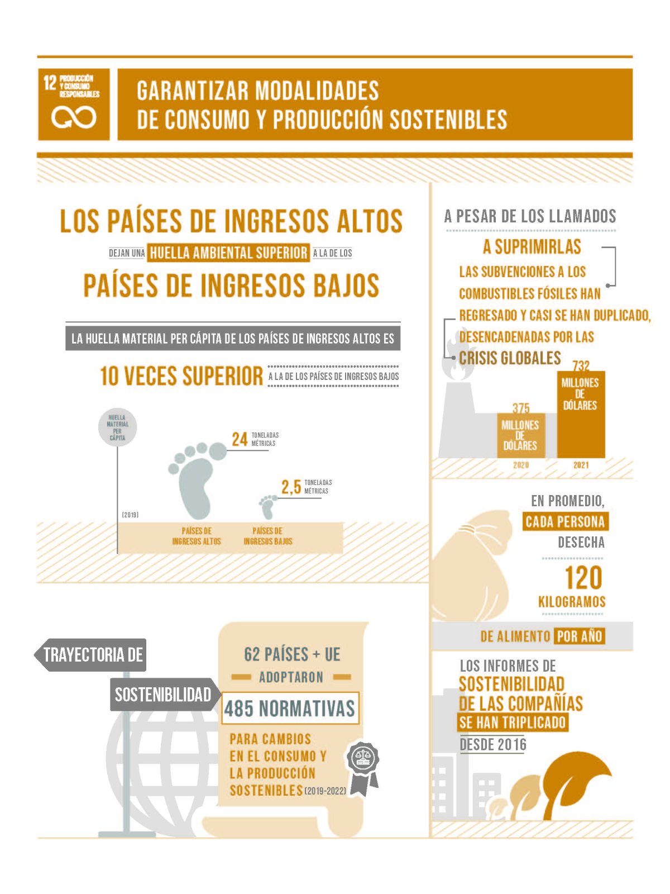
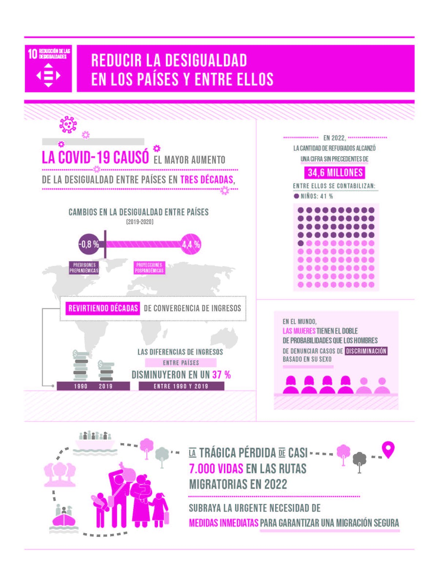
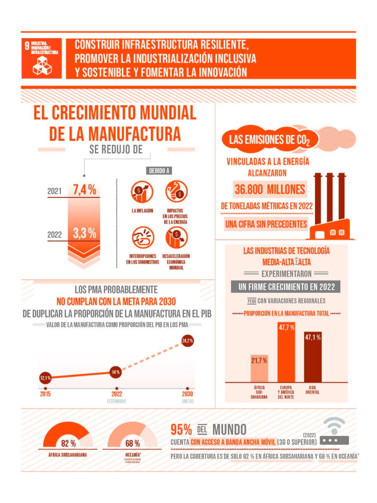
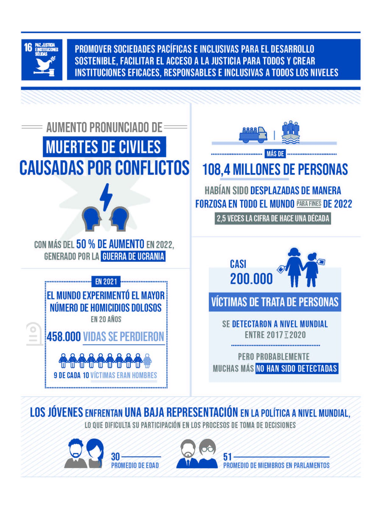
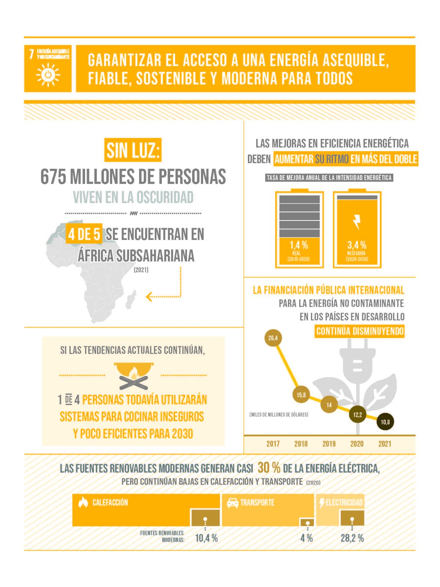

# 1. Identificación de los aspectos de sostenibilidad y ODS más relevantes en cada sector productivo.

## 1. Comercio y Distribución
### Aspectos de Sostenibilidad Relevantes:
- Consumo responsable y ética en la cadena de suministro.
- Reducción de residuos, embalajes sostenibles y economía circular.
- Eficiencia energética en transporte y logística.
- Condiciones laborales y equidad en la cadena de valor.

### ODS Relacionados:
- ODS 8: Trabajo decente y crecimiento económico.

- ODS 12: Producción y consumo responsables.

- ODS 13: Acción por el clima.

- ODS 10: Reducción de desigualdades.  

---

## 2. Construcción e Ingeniería Civil
### Aspectos de Sostenibilidad Relevantes:
- Uso de materiales sostenibles y reciclados.
- Eficiencia energética en edificaciones.
- Impacto ambiental y urbanismo responsable.
- Seguridad laboral.

### ODS Relacionados:
- ODS 9: Industria, innovación e infraestructura.

- ODS 11: Ciudades y comunidades sostenibles.

- ODS 12: Producción y consumo responsables.

- ODS 13: Acción por el clima.

---

## 3. Sector Agroalimentario
### Aspectos de Sostenibilidad Relevantes:
- Agricultura sostenible y agroecología.
- Seguridad alimentaria y nutricional.
- Uso eficiente del agua y suelo.
- Reducción de desperdicio alimentario.

### ODS Relacionados:
- ODS 2: Hambre cero.

- ODS 12: Producción y consumo responsables.

- ODS 13: Acción por el clima.

- ODS 15: Vida de ecosistemas terrestres.

---

## 4. Farmacéutico y Sanitario
### Aspectos de Sostenibilidad Relevantes:
- Acceso equitativo a medicamentos y servicios de salud.
- Investigación e innovación sostenible.
- Seguridad en el uso de productos químicos y farmacéuticos.
- Reducción de residuos médicos.

### ODS Relacionados:
- ODS 3: Salud y bienestar.

- ODS 9: Industria, innovación e infraestructura.

- ODS 12: Producción y consumo responsables.

- ODS 10: Reducción de desigualdades.

---

## 5. Sector Industrial
### Aspectos de Sostenibilidad Relevantes:
- Eficiencia energética y reducción de emisiones.
- Economía circular: reciclaje, reutilización de materiales.
- Condiciones laborales y seguridad.
- Minimización de residuos y vertidos.

### ODS Relacionados:
- ODS 9: Industria, innovación e infraestructura.

- ODS 12: Producción y consumo responsables.

- ODS 8: Trabajo decente y crecimiento económico.

- ODS 13: Acción por el clima.

---

## 6. Servicios Financieros (Banca y Seguros)
### Aspectos de Sostenibilidad Relevantes:
- Finanzas sostenibles e inversiones responsables (ESG).
- Acceso equitativo a servicios financieros.
- Gestión de riesgos climáticos.
- Transparencia y ética empresarial.

### ODS Relacionados:
- ODS 8: Trabajo decente y crecimiento económico.

- ODS 10: Reducción de desigualdades.

- ODS 13: Acción por el clima.

- ODS 16: Paz, justicia e instituciones sólidas.

---

## 7. Servicios Profesionales
### Aspectos de Sostenibilidad Relevantes:
- Integración de sostenibilidad en la estrategia empresarial de clientes.
- Promoción de la ética y la responsabilidad social.
- Desarrollo de capacidades en sostenibilidad.
- Igualdad de género e inclusión laboral.

### ODS Relacionados:
- ODS 8: Trabajo decente y crecimiento económico.

- ODS 5: Igualdad de género.

- ODS 16: Paz, justicia e instituciones sólidas.

---

## 8. Telecomunicaciones y Nuevas Tecnologías
### Aspectos de Sostenibilidad Relevantes:
- Reducción de la brecha digital.
- Ciberseguridad y privacidad.
- Eficiencia energética de infraestructuras (centros de datos).
- Gestión de residuos electrónicos.

### ODS Relacionados:
- ODS 9: Industria, innovación e infraestructura.

- ODS 4: Educación de calidad.

- ODS 12: Producción y consumo responsables.

- ODS 13: Acción por el clima.

---

## 9. Turismo
### Aspectos de Sostenibilidad Relevantes:
- Turismo sostenible y responsable.
- Conservación del patrimonio cultural y natural.
- Desarrollo económico local e inclusión social.
- Reducción de impacto ambiental.

### ODS Relacionados:
- ODS 8: Trabajo decente y crecimiento económico.

- ODS 11: Ciudades y comunidades sostenibles.

- ODS 12: Producción y consumo responsables.

- ODS 15: Vida de ecosistemas terrestres.

---

## 10. Utilidades y Energía (Electricidad, Agua, Gas)
### Aspectos de Sostenibilidad Relevantes:
- Desarrollo de energías renovables.
- Eficiencia energética.
- Acceso universal a servicios básicos.
- Protección de recursos naturales.

### ODS Relacionados:
- ODS 7: Energía asequible y no contaminante.

- ODS 6: Agua limpia y saneamiento.

- ODS 13: Acción por el clima.

- ODS 9: Industria, innovación e infraestructura.

---

## 11. Sector Educativo y Cultural
### Aspectos de Sostenibilidad Relevantes:
- Educación inclusiva y de calidad.
- Sensibilización sobre desarrollo sostenible.
- Promoción de la cultura como motor de inclusión social.
- Reducción de desigualdades educativas.

### ODS Relacionados:
- ODS 4: Educación de calidad.

- ODS 10: Reducción de desigualdades.

- ODS 5: Igualdad de género.

- ODS 16: Paz, justicia e instituciones sólidas.

---

## 12. Sector Público y Administraciones
### Aspectos de Sostenibilidad Relevantes:
- Gobernanza ética y transparente.
- Políticas públicas para desarrollo sostenible.
- Inclusión social y equidad.
- Adaptación y mitigación del cambio climático.

### ODS Relacionados:
- ODS 16: Paz, justicia e instituciones sólidas.

- ODS 10: Reducción de desigualdades.

- ODS 13: Acción por el clima.

- ODS 11: Ciudades y comunidades sostenibles.

---

[Ir a la página siguiente](./1.1_sector_productivo_Mena.md)