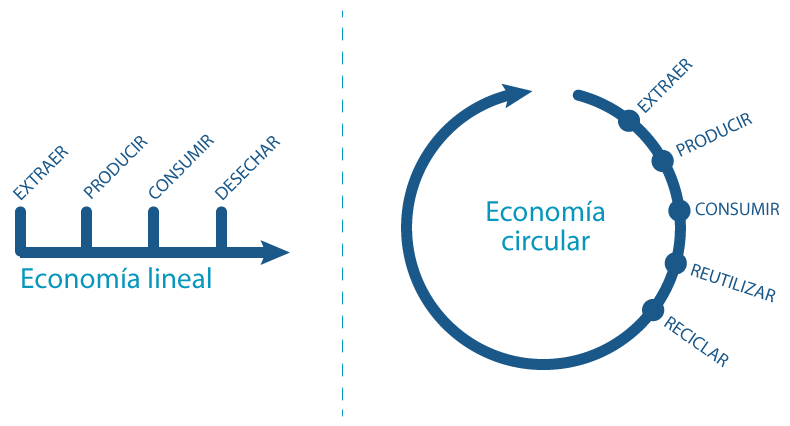

## 5.1. Economía Lineal vs. Economía Circular: Comparación y Transiciones Clave

###  **Economía Lineal (Modelo Tradicional)**
- **Modelo**: Extraer -> Producir -> Usar -> Desechar.
- **Características**:
  - Uso intensivo de recursos naturales y energía.
  - Producción masiva de residuos y contaminación.
  - Obsolescencia programada (productos diseñados para durar poco).
  - Alta dependencia de materias primas vírgenes.
- **Problemas**:
  - Agotamiento de recursos.
  - Generación de grandes cantidades de residuos (basura, contaminación).
  - Impacto negativo en el clima (emisiones de CO₂).

---

###  **Economía Circular (Modelo Sostenible)**
- **Modelo**: Diseñar ->  Producir -> Usar -> Reutilizar/Reciclar/Remanufacturar -> Regenerar.
- **Características**:
  - Ecodiseño: productos diseñados para ser duraderos, reparables y reciclables.
  - Reutilización, reciclaje y valorización de residuos.
  - Minimización del desperdicio y uso eficiente de recursos.
  - Uso de energías renovables y reducción de emisiones.
- **Beneficios**:
  - Disminución de la presión sobre los recursos naturales.
  - Reducción de residuos y contaminación.
  - Estímulo a la innovación y a nuevos modelos de negocio (economía colaborativa, servicios en lugar de propiedad).

---

### Transiciones Clave hacia la Economía Circular:
- **Cambio de diseño**: creación de productos modulares, duraderos y fáciles de reparar.
- **Transformación de modelos de negocio**: de venta de productos a provisión de servicios (Ej.: alquiler, leasing).
- **Educación y sensibilización**: fomentar el consumo responsable.
- **Políticas públicas**: regulaciones para fomentar el reciclaje, ecodiseño y responsabilidad extendida del productor.
- **Tecnología e innovación**: desarrollo de tecnologías para reciclaje avanzado y eficiencia productiva.

---

[Ir a la página siguiente](./5.2_Economía_verde_y_azul_frente_al_modelo_clásico_Mena.md)