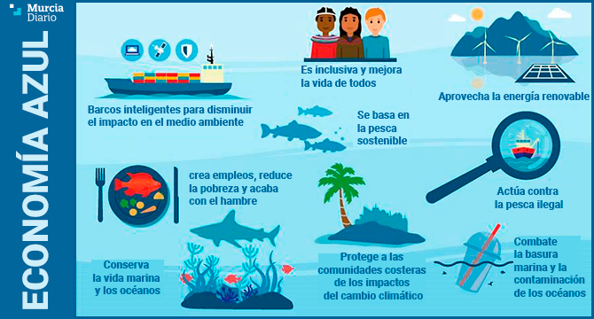

## 5.2. Economía Verde y Azul frente al Modelo Clásico

###  **Economía Verde**
- **Definición**: Modelo económico que promueve el desarrollo sostenible, reduciendo los impactos ambientales y fomentando un uso eficiente de los recursos naturales.
- **Objetivos**:
  - Mitigar el cambio climático.
  - Proteger la biodiversidad.
  - Promover una economía baja en carbono.
- **Ámbitos de aplicación**:
  - Energía renovable (solar, eólica, biomasa).
  - Agricultura sostenible.
  - Construcción verde (eco-edificación).
  - Transporte limpio (eléctrico, movilidad sostenible).

---

###  **Economía Azul**
- **Definición**: Modelo económico enfocado en el uso sostenible de los océanos, mares y recursos acuáticos para el crecimiento económico, mejorando los medios de vida y el empleo, y al mismo tiempo preservando la salud de los ecosistemas marinos.
- **Objetivos**:
  - Pesca y acuicultura sostenibles.
  - Turismo costero y marino sostenible.
  - Energía marina renovable (mareomotriz, eólica offshore).
  - Protección de ecosistemas marinos (corales, manglares).
- **Relación con ODS**:
  - Directamente vinculado con el **ODS 14: Vida submarina**, así como con el **ODS 13: Acción por el clima**.

---
[Ir a la página siguiente de mi trabajo (punto 9)](../9_producción_y_criterios_de_sostenibilidad_ra4_pisa3_6_Mena/9.1._Sostenibilidad_en_procesos_de_productos_físicos_Mena.md)