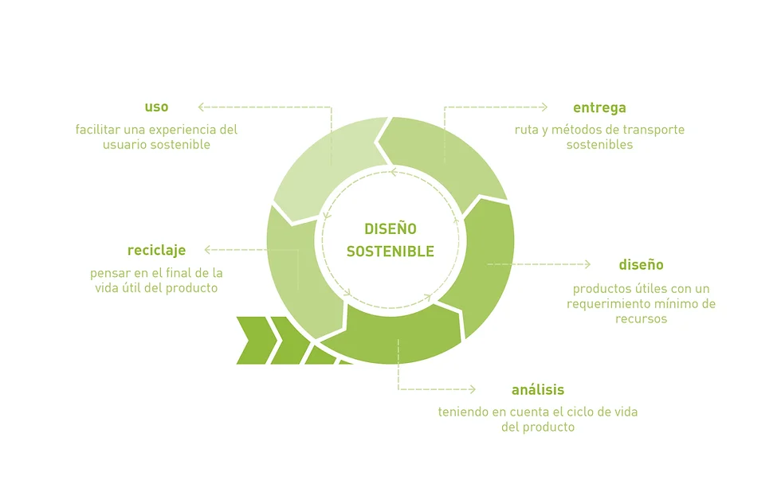
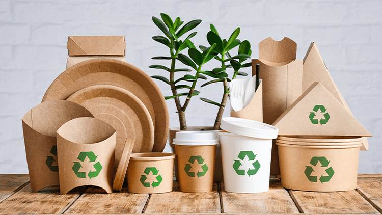
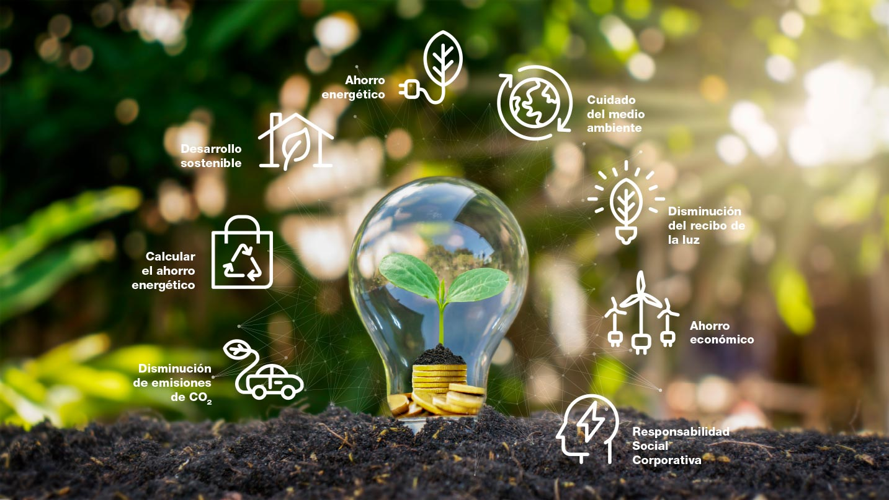
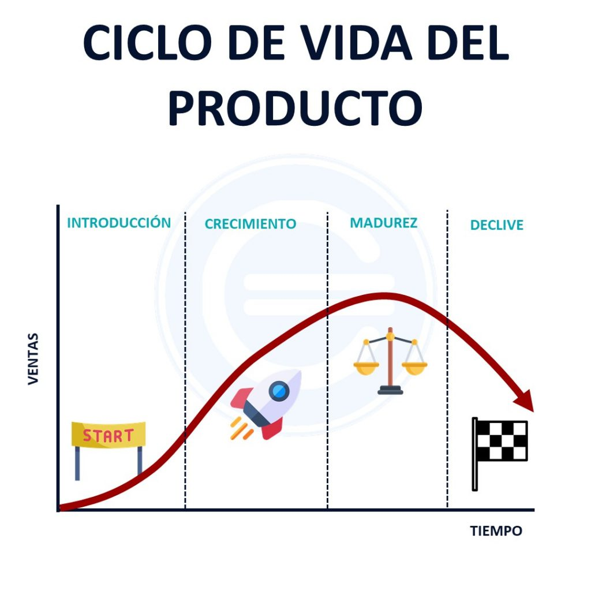

## 9.1. Sostenibilidad en Procesos de Productos Físicos: Diseño, Materiales y Uso Eficiente de Recursos

###  **1. Diseño Sostenible (Ecodiseño)**

- **Objetivo**: Crear productos que minimicen el impacto ambiental durante todo su ciclo de vida (desde la extracción de materias primas hasta su disposición final).
- **Principios clave**:
  - **Durabilidad**: Productos que duren más tiempo y sean resistentes al uso.
  - **Reparabilidad y actualizabilidad**: Facilitar la reparación y actualización de los productos para prolongar su vida útil.
  - **Desmontaje sencillo**: Diseñar productos que se puedan desmontar fácilmente para facilitar su reparación, reutilización o reciclaje.
  - **Diseño modular**: Permite reemplazar partes específicas sin tener que desechar todo el producto.
- **Ejemplos**:
  - Electrónica con baterías reemplazables.
  - Mobiliario modular y reciclable.
  - Equipos tecnológicos con componentes actualizables.

---

###  **2. Selección Responsable de Materiales**

- **Objetivo**: Utilizar materiales que reduzcan el impacto ambiental, sean reciclables o provengan de fuentes sostenibles.
- **Criterios**:
  - **Materiales reciclados o reciclables**: Favorecer el uso de materiales que ya han sido reciclados o que puedan reciclarse al final de la vida útil del producto.
  - **Materiales biodegradables o compostables**: Cuando sea posible, utilizar materiales que se descompongan sin dañar el medio ambiente.
  - **Materiales de bajo impacto ambiental**: Evitar materiales tóxicos, contaminantes o que requieran grandes cantidades de energía para su producción.
  - **Certificaciones ambientales**: Seleccionar materiales con certificaciones de sostenibilidad (Ej.: FSC para madera, etiquetas ecológicas).

---

###  **3. Uso Eficiente de Recursos y Energía en Producción**

- **Objetivo**: Minimizar el consumo de recursos (agua, energía, materias primas) y reducir los residuos generados durante la fabricación.
- **Prácticas sostenibles**:
  - **Optimización de procesos productivos**: Rediseñar procesos para reducir el desperdicio de materiales y energía.
  - **Recirculación de recursos**: Reutilización de residuos y subproductos en otros procesos productivos.
  - **Uso de energías renovables**: Incorporación de fuentes de energía limpias (solar, eólica, biomasa) en las plantas de producción.
  - **Reducción de la huella hídrica**: Implementación de tecnologías para el ahorro y reutilización del agua.
  - **Producción local**: Acortar las cadenas de suministro para reducir el transporte y las emisiones asociadas.
- **Ejemplos**:
  - Fábricas alimentadas por energía solar.
  - Producción de envases a partir de plástico reciclado.
  - Procesos de manufactura que reutilizan el agua en ciclos cerrados.

---

###  **4. Ciclo de Vida del Producto y Economía Circular**

- **Aplicación del enfoque de ciclo de vida**:
  - Evaluar el impacto ambiental del producto desde su creación hasta su disposición final.
  - Incluir estrategias para la reutilización, reciclaje y valorización de productos al final de su vida útil.
- **Contribución a la economía circular**:
  - **Reintroducción de materiales**: Integrar los productos al final de su uso en nuevas cadenas productivas.
  - **Modelos de negocio basados en servicios**: Alquiler, leasing o uso compartido de productos (ej.: renting de tecnología).
  - **Devolución de productos**: Sistemas de recogida de productos usados para su reciclaje o reacondicionamiento.

---

###  **5. Ejemplos de Criterios de Sostenibilidad Aplicados a Productos Físicos**

| Proceso/Productor                     | Criterio de Sostenibilidad Aplicado                           | Impacto Positivo                       |
|--------------------------------------|-------------------------------------------------------------|--------------------------------------|
| Fabricación de electrodomésticos     | Uso de piezas modulares y reciclables                        | Facilita reparación y reciclaje       |
| Producción de mobiliario              | Madera certificada FSC y adhesivos sin tóxicos              | Protección de bosques y salud humana |
| Industria textil                     | Uso de fibras recicladas (poliéster reciclado, algodón orgánico)| Reducción de residuos y uso de agua |
| Tecnología (ordenadores, móviles)    | Materiales reciclables, diseño para desmontaje               | Reducción de RAEE y prolongación de vida útil|
| Construcción (edificios)              | Materiales sostenibles, eficiencia energética               | Menor huella ambiental y ahorro energético |

---

[Ir a la página siguiente](./9.2._Sostenibilidad_en_procesos_de_productos_lógicos_Mena.md)