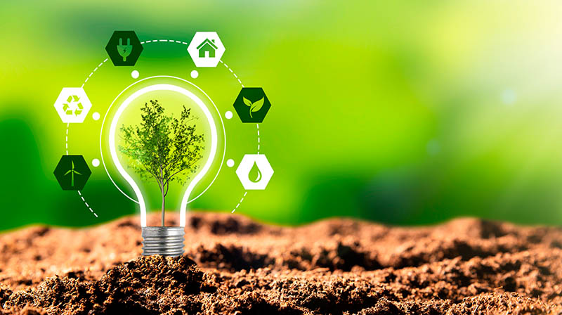
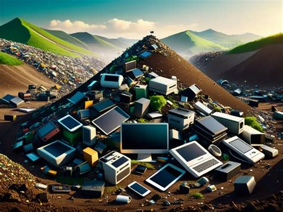

## 9.2. Sostenibilidad en Procesos de Productos Lógicos: Optimización Energética y Reducción de Obsolescencia

Los **productos lógicos** (como software, aplicaciones, plataformas digitales y servicios basados en la nube) también tienen un impacto ambiental significativo, aunque muchas veces no sea tan visible como en los productos físicos. La sostenibilidad en este ámbito se centra especialmente en la **optimización energética**, la **reducción de la obsolescencia** y la **eficiencia del ciclo de vida digital**.

---

###  **1. Optimización Energética en el Desarrollo y Uso de Software**

- **Objetivo**: Reducir el consumo de energía asociado al desarrollo, despliegue y uso de productos lógicos.
- **Prácticas sostenibles**:
  - **Código eficiente**: Escribir código optimizado que consuma menos recursos computacionales.
  - **Reducción de procesos innecesarios**: Evitar el uso excesivo de algoritmos complejos si no son necesarios.
  - **Optimización de bases de datos**: Estructuras eficientes que reduzcan la necesidad de consultas intensivas.
  - **Uso racional de servidores**: Minimizar el uso de recursos de backend mediante arquitecturas ligeras (Ej.: serverless, microservicios).
  - **Data centers verdes**: Utilizar proveedores de nube que operen con energías renovables (Ej.: Google Cloud, AWS Green, Microsoft Azure sostenible).
  - **Compresión de datos y optimización de tráfico**: Reducir el volumen de datos que deben transmitirse (Ej.: algoritmos de compresión, minimización de archivos).
- **Ejemplos**:
  - Desarrollo de apps con bajo uso de batería y memoria.
  - Algoritmos de IA entrenados y optimizados con menos coste energético.
  - Plataformas que adaptan la calidad del contenido según la capacidad del dispositivo (streaming adaptativo).

---

###  **2. Reducción de la Obsolescencia Lógica y Compatibilidad**

- **Objetivo**: Asegurar que los productos lógicos sean útiles y funcionales durante el mayor tiempo posible, evitando que los usuarios se vean obligados a adquirir nuevos dispositivos o sistemas por falta de soporte o incompatibilidad.
- **Prácticas sostenibles**:
  - **Desarrollo multiplataforma**: Software que funcione en diferentes sistemas y versiones, incluyendo versiones antiguas de hardware y sistemas operativos.
  - **Actualizaciones ligeras y eficientes**: Mantener el software actualizado sin aumentar innecesariamente los requisitos de hardware.
  - **Retrocompatibilidad**: Asegurar que las nuevas versiones sigan siendo compatibles con los dispositivos anteriores.
  - **Soporte prolongado (LTS - Long Term Support)**: Ofrecer versiones de software con soporte técnico a largo plazo, evitando la necesidad de migraciones forzadas.
  - **Evitar la obsolescencia programada del software**: No introducir bloqueos intencionados que inutilicen el software en versiones futuras o en hardware menos potente.
- **Ejemplos**:
  - Sistemas operativos y apps que siguen funcionando en dispositivos antiguos (Ej.: versiones ligeras para hardware limitado).
  - Software open source con comunidades que mantienen versiones antiguas.
  - Programas con actualizaciones adaptadas a equipos con menos recursos.

---

###  **3. Desarrollo de Software Sostenible: Buenas Prácticas**

| Ámbito                                 | Práctica sostenible                                    | Beneficio ambiental y social                           |
|---------------------------------------|------------------------------------------------------|-----------------------------------------------------|
| **Desarrollo de código**               | Código limpio, eficiente, modular                    | Menor consumo energético y facilidad de mantenimiento |
| **Estructura y base de datos**         | Consultas eficientes, índices optimizados           | Reducción de uso de servidores y energía             |
| **Alojamiento y nube**                 | Usar proveedores con energías renovables             | Disminución de huella de carbono                     |
| **Compatibilidad y actualizaciones**  | Soporte a largo plazo, retrocompatibilidad          | Reducción de residuos electrónicos (evita cambio de dispositivos) |
| **Gestión de datos**                   | Minimizar almacenamiento innecesario                 | Ahorro energético y optimización de espacio          |
| **Interfaz de usuario (UI/UX)**        | Diseños ligeros y accesibles                        | Menor carga de procesamiento y mayor accesibilidad  |

---

###  **4. Relación con los Objetivos de Desarrollo Sostenible (ODS)**

La sostenibilidad en productos lógicos contribuye directamente a varios **ODS**, entre ellos:

| ODS | Descripción                                     | Relación con software sostenible                          |
|-----|------------------------------------------------|----------------------------------------------------------|
| ODS 9 | Industria, innovación e infraestructura       | Innovación en tecnologías limpias y eficientes           |
| ODS 12 | Producción y consumo responsables            | Software diseñado para durar, sin fomentar consumo excesivo |
| ODS 13 | Acción por el clima                          | Reducción de emisiones mediante eficiencia energética    |
| ODS 7 | Energía asequible y no contaminante           | Uso de energías renovables en servidores y data centers  |

---

[Ir a la bibliografia](../bibliografia_pisa3_6_Mena.md)